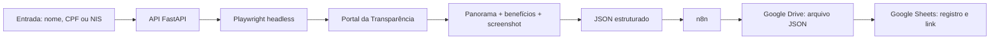

# RPA — Portal da Transparência

Solução do [desafio full stack Python — desafio 01](https://github.com/mostqi/desafios-fullstack-python/tree/main/desafio-01). O projeto automatiza o próprio [Portal da Transparência](https://portaldatransparencia.gov.br/) com Python e Playwright, expõe o robô por uma API FastAPI e implementa o bônus com n8n, Google Drive e Google Sheets.

## Entrega

| Componente | Implementação |
|---|---|
| Automação | Python + Playwright controlando o portal oficial |
| Execução | Chromium headless, contexto isolado e concorrência configurável |
| Coleta | Panorama da pessoa e detalhes de Auxílio Brasil, Auxílio Emergencial e Bolsa Família |
| Evidência | Screenshot PNG codificado em Base64 dentro do JSON |
| API | FastAPI, OpenAPI/Swagger, autenticação por `X-API-Key` e HTTPS |
| Hiperautomação | n8n com nós oficiais Google Drive e Google Sheets |
| Implantação | Docker em VPS, disponível em `portfolio.ecommjet.com.br` |
| Testes | 36 testes automatizados e validação estrutural do workflow n8n |

Links da aplicação:

- API: [https://portfolio.ecommjet.com.br](https://portfolio.ecommjet.com.br)
- Swagger: [https://portfolio.ecommjet.com.br/docs](https://portfolio.ecommjet.com.br/docs)
- OpenAPI: [https://portfolio.ecommjet.com.br/openapi.json](https://portfolio.ecommjet.com.br/openapi.json)
- Health check: [https://portfolio.ecommjet.com.br/health](https://portfolio.ecommjet.com.br/health)

Os endpoints de consulta exigem uma chave no cabeçalho `X-API-Key`. A chave de avaliação é compartilhada separadamente e não fica no repositório.

## Fluxo da solução



O robô abre a página inicial do portal, navega até a busca de pessoas, informa o termo e o filtro social, escolhe o primeiro resultado e coleta o panorama. Em seguida, abre os detalhes dos benefícios previstos no enunciado, percorre a paginação e devolve um único documento JSON.

Cada consulta cria um contexto de navegador separado. Um semáforo limita a quantidade de navegadores simultâneos sem compartilhar cookies, páginas ou dados entre execuções.

## Executar localmente

Requisitos: Python 3.11 ou superior e Node.js apenas para validar o workflow n8n.

```bash
python3 -m venv .venv
source .venv/bin/activate
pip install -e '.[test]'
export PLAYWRIGHT_BROWSERS_PATH="$PWD/.browsers"
python -m playwright install chromium
cp .env.example .env
uvicorn app.api:app --host 127.0.0.1 --port 8000
```

No Linux, instale também as dependências do Chromium:

```bash
python -m playwright install --with-deps chromium
```

Abra `http://127.0.0.1:8000/docs` para usar o Swagger.

### Linha de comando

```bash
python -m app.cli 'NOME, CPF OU NIS' --output outputs/consulta.json
```

Use `--social` para marcar o filtro de beneficiário de programa social:

```bash
python -m app.cli 'NOME, CPF OU NIS' --social --output outputs/consulta.json
```

O processo retorna código `0` para coleta completa e `2` para resultado parcial ou erro estruturado.

### API

```bash
curl -X POST http://127.0.0.1:8000/consultas \
  -H 'Content-Type: application/json' \
  -H 'X-API-Key: SUA_CHAVE' \
  -d '{"termo":"NOME, CPF OU NIS","beneficiario_programa_social":false}' \
  --output resultado.json
```

`GET /health` verifica o processo da API. A disponibilidade do Portal da Transparência é avaliada durante cada consulta.

### Docker

```bash
docker compose up --build
```

A imagem inclui Python, Chromium e as dependências de sistema do Playwright.

## Contrato do resultado

| Campo | Conteúdo |
|---|---|
| `consulta_id` | UUID exclusivo da execução |
| `consultado_em` | data e hora UTC |
| `status` | `sucesso`, `parcial` ou `erro` |
| `codigo` e `mensagem` | diagnóstico estruturado |
| `pessoa` | nome, CPF/NIS disponíveis, localidade e panorama |
| `beneficios` | programa, URL, páginas extraídas, completude e erro |
| `evidencia` | MIME type e screenshot Base64 do panorama |
| `etapa` e `duracao_ms` | etapa alcançada e duração total |
| `diagnostico` | URL, título e captura da página em uma falha externa |

Os snapshots preservam URL, texto, campos e tabelas conforme exibidos. Campos ausentes ficam `null`, valores monetários permanecem textuais e o CPF mascarado não é reconstruído.

HTTP 200 representa coleta completa ou parcial; o consumidor deve conferir `status` e `beneficios[].completo`. A API usa 401 para autenticação inválida, 404 para ausência de pessoa, 422 para entrada inválida, 502 para bloqueio/falha do portal e 504 para prazo excedido.

## CAPTCHA e bloqueio automatizado

O Portal da Transparência pode apresentar uma verificação humana do AWS WAF conforme rede, IP e sessão. O enunciado exige automação headless, mas não exige resolver CAPTCHA.

Quando a verificação aparece, o robô não tenta burlá-la. Ele encerra a consulta com `status=erro`, `codigo=PORTAL_BLOQUEADO` e uma captura de diagnóstico. Esse tratamento evita timeout silencioso e impede que dados incompletos sejam apresentados como uma coleta válida.

Os seletores e a extração foram validados no layout real em sessão autorizada. A suíte automatizada usa Chromium real e páginas locais determinísticas, sem enviar CPFs ou nomes ao governo.

## Bônus: n8n, Drive e Sheets

O arquivo [workflows/n8n-consulta-google.json](workflows/n8n-consulta-google.json) contém o workflow completo:

1. o gatilho **1. Configurar armazenamento** cria a pasta, a planilha e suas colunas na conta Google conectada;
2. o gatilho **2. Executar consulta** recebe os parâmetros e localiza esses recursos pelo nome;
3. chama `POST /consultas` com `X-API-Key`;
4. valida o contrato retornado;
5. converte o resultado integral em um arquivo JSON;
6. envia o arquivo para a pasta criada com o nó oficial **Google Drive**;
7. registra `consulta_id`, nome, CPF, data/hora, link do JSON, status e código no nó oficial **Google Sheets**;
8. devolve um recibo com os links do arquivo e da planilha.

O primeiro gatilho é executado uma vez após a importação; o segundo inicia cada consulta. Nenhum ID de pasta ou planilha é versionado. O nome do arquivo segue o padrão `CONSULTA_ID_DATA_HORA.json`. As credenciais OAuth ficam no cofre de credenciais do n8n e não são exportadas no workflow. O arquivo do Drive permanece privado na conta Google; o fluxo não cria compartilhamento público.

Detalhes da integração estão em [docs/bonus-google.md](docs/bonus-google.md).

## Testes

```bash
source .venv/bin/activate
export PLAYWRIGHT_BROWSERS_PATH="$PWD/.browsers"
python -m pytest -q
node scripts/verify_workflow.cjs
```

A suíte cobre entrada e autenticação, busca por nome/documento, filtro social, primeiro resultado, três benefícios, paginação, screenshot Base64, ausência de resultados, bloqueio WAF, timeout, coleta parcial, API, isolamento de consultas simultâneas e integração Google simulada.

O script Node valida conexões, scripts, geração do arquivo JSON, presença dos nós oficiais Drive/Sheets, mapeamento das sete colunas e ausência de credenciais no artefato versionado.

## Configuração

| Variável | Padrão | Função |
|---|---|---|
| `HEADLESS` | `true` | executa o Chromium sem janela |
| `MAX_CONCURRENT` | `3` | consultas simultâneas por processo |
| `QUERY_TIMEOUT_SECONDS` | `120` | prazo total, incluindo fila |
| `NAVIGATION_TIMEOUT_MS` | `30000` | prazo das ações Playwright |
| `WAF_WAIT_MS` | `8000` | espera por uma verificação automática normal |
| `MAX_DETAIL_PAGES` | `100` | limite de páginas por benefício |
| `API_KEY` | vazia | valor aceito no cabeçalho `X-API-Key` |
| `REQUIRE_API_KEY` | `false` | impede iniciar sem chave quando ativado |

A implantação pública usa `REQUIRE_API_KEY=true`, HTTPS e um único worker. A concorrência continua configurável por `MAX_CONCURRENT` de acordo com a memória disponível.

## Organização

```text
app/
  api.py              API e OpenAPI
  robot.py            ciclo do navegador e navegação
  extraction.py       leitura do panorama, tabelas e benefícios
  models.py           contrato do resultado
  cli.py              execução em linha de comando
tests/                testes unitários e de integração com Chromium
workflows/            workflow n8n importável
scripts/              diagnósticos e validação do workflow
docs/                 arquitetura do bônus, implantação e relatório técnico
```

Dados de consultas, screenshots, tokens e variáveis locais são ignorados pelo Git por meio de `.gitignore`. A aplicação não registra o conteúdo das respostas nos logs.
